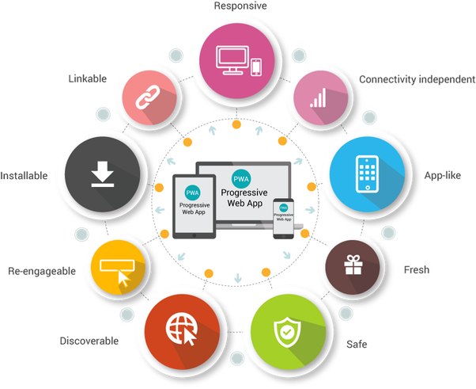

An Adventure in Angular
=======================

.. figure:: angular_logo.png
    :width: 200px
    :align: center
    :height: 100px
    :alt: alternate text
    :figclass: align-center

    Angular Logo

In 2012, Google first released their JavaScript front-end framework called
AngularJS. [#f8]_ However, in 2016, Angular2+ was created as an open-source,
TypeScript-based front-end web application platform. [#f8]_ Both AngularJS
and Angular2+ are well-known and used by many developers. I will be diving
into the architecture of Angular applications, comparing Angular to its
history and other frameworks, discovering applications Angular can be used
for, and how we can use it to build a single-page web application.

The Architecture of an Angular Application
------------------------------------------

    Angular Concepts

NgModules
^^^^^^^^^

NgModule classes that provide a way to group sets of related functionality.
NgModules can import other NgModule functionality, as well as allowing their
own functionality to be imported in other NgModules. It is beneficial to use
functional modules to organize code for easier re-usability. A NgModule is
defined by ``@NgModule()`` and the properties describe it. To start the
Angular app, or to enable bootstrapping, there must be a root module, usually
named AppModule.

The following NgModule is an example of a root NgModule, AppModule:

.. code-block:: typescript
    :linenos:

    import { NgModule } from '@angular/core';
    import { BrowserModule } from '@angular/platform-browser';
    import { AppComponent } from './app.component';

    // @NgModule decorator with its metadata
    @NgModule({
        imports:      [ BrowserModule ],
        providers:    [ Logger ],
        declarations: [ AppComponent ],
        exports:      [ AppComponent ],
        bootstrap:    [ AppComponent ]
    })
    export class AppModule { }

Components and Templates
^^^^^^^^^^^^^^^^^^^^^^^^

NgModules are used to organize **components**. One of the basic building
blocks of the Angular framework architecture is the Angular component. Only the
AppComponent component is used in the AppModule example above. However,
any other NgModule can include many components. "All components connect a
component hierarchy with the page document object model (DOM). Each
**component** defines a class that contains application data and login, and
is associated with the HTML template that defines a view to be displayed in a
target environment."

An example of a Component is:

.. code-block:: typescript
    :linenos:
    :caption: ExampleComponent.ts
    :emphasize-lines: 3-5

    import { Component } from '@angular/core';
    @Component({
        selector: 'example-selector',
        templateUrl: './example-html-template.html',
        styleUrls: ['./example-separate-css-file.css']
    })
    export class ExampleComponent {}

The ExampleComponent stores the css files in the ``styleUrls`` property and the
HTML file in the ``templateUrl`` property. The ``selector`` property stores the name of the CSS selector that creates
and inserts an instance of the ExampleComponent where ever it finds
``<example-selector></example-selector>`` in the template HTML.

A **template** combines HTML with Angular syntax, such as the
ExampleComponent component above. A template's directives provide the program
logic, while the binding syntax connects the app data and the DOM. The
binding syntax could be event binding, where the app responds to user input,
or property binding, which allows developers to inserts the app data into the
HTML file.

Services
^^^^^^^^

In addition, Angular components define views and use **services** that provide
specific functionality. [#f6]_ Service classes can be created to share data
and/or logic over multiple views and can depend on other services.

The example below shows ``HeroService`` depends on the ``Logger`` service and
the ``BackendService``. [#f6]_

.. code-block:: typescript
    :caption: HeroService.ts
    :linenos:

    import { Injectable } from '@angular/core';

    @Injectable({
      providedIn: 'root',
    })
    export class HeroService {
      private heroes: Hero[] = [];

      constructor(
        private backend: BackendService,
        private logger: Logger) { }

      getHeroes() {
        this.backend.getAll(Hero).then( (heroes: Hero[]) => {
          this.logger.log(`Fetched ${heroes.length} heroes.`);
          this.heroes.push(...heroes); // fill cache
        });
        return this.heroes;
      }
    }

These **services** can be injected dependencies allowing code to be modular,
reusable, and efficient. Dependencies are not always services; they can be
objects, functions, values, etc. An **dependency injection** is used to request
dependencies from external sources instead of creating them. Before you
think about using a service, you must register one of its providers, which
is an object that explains how to object the dependency. The providers
property accepts services that then registers the services with the class
injector. The **injector** maintains created service instances and returns a new
one if the service instance does not exist. An example of a service being
registered in a component is below.

.. code-block:: typescript
    :linenos:
    :caption: SomeComponentUsingHeroService.ts

    @Component({
      selector:    'app-hero-list',
      templateUrl: './hero-list.component.html',
      providers:  [ HeroService ]
    })

Pipes
^^^^^

While services can share data, **pipes** can transform data. Pipes are an
Angular concept that filter data before displaying it on the view. The pipe (|)
operator can be used like ``{{title | uppercase }}``, where the ``uppercase``
is a built-in pipe that transforms the title text into all uppercase lettering.
Like most Angular concepts, you can use built-in pipes and create your own
pipes too.

Below is a custom pipe that takes in a number array and transforms
it into an increasing array of positive numbers. [#f3]_

.. code-block:: typescript
    :linenos:
    :caption: PositiveNumberPipe.ts

    import { Pipe, PipeTransform } from '@angular/core';

    @Pipe({ name: 'positiveNumber' })
    export class PositivePipe implements PipeTransform {
            transform(value: number[]): number[] {
                return value.filter(v => v > 0);
        }
    }

The pipe ``positiveNumber`` can be referenced in the template html file,
where the number array ``number`` is declared in the ``Component`` class. The
syntax may look like ``{{ numbers | positiveNumbers }}``. [#f3]_

AngularJS versus Angular2+
--------------------------

Google originally created the AngularJS framework for web-designers,
however, it largest share of usage has been among front-end developers. It is
open-sourced library used for web application development. After a couple
years, the structure of web development changed as JavaScript became more
advanced. Thus came the rewrite of Angular2+.

Angular 2 was released in 2016 as an open-source, TypeScript-based front-end web
application platform. [#f8]_ TypeScript is a static, object-oriented language
that also contains a set of tools that is converted into JavaScript. While
AngularJS's architecture is based on the model-view-controller (MVC) design,
Angular 2+ uses model-view-viewmodel (MVVM). [#f8]_ However, both designs
can be implemented in both AngularJS and Angular2+.

    AngularJS vs. Angular2+

There are many advantages in using Angular2+ over AngularJS. A Single Page
Application (SPA) is more easily implemented in Angular2+, than AngularJS.
SPA is a website that dynamically rewrites the current web page based on user
interactions and new data from the server. [#f9]_ Unlike AngularJS, Angular
2+ was built so that it could be used for large and cross-platform
applications and it is also mobile-oriented. [#f8]_ Also, Angular2+ is
considered to be more well-defined, some things can be done in multiple ways.
Similarly, the syntax of Angular2+ is said to be simpler than AngularJS.
[#f9]_ When it comes to the binding syntax, which allows data to bind to
pages and update automatically, AngularJS uses ng directives, which are
extended HTML attributes using the prefix ``ng-``. Examples include the
``ng-app`` directive that initializes the app and the ``ng-init`` directive
that initializes the app data. AngularJS uses ``{{ }}`` to bind the data to
the view, while Angular2+ uses ``( )`` and ``[ ]`` for event and property
binds. [#f8]_

Angular JS Example [#f14]_
^^^^^^^^^^^^^^^^^^^^^^^^^^

.. code-block:: HTML
    :caption: data_binding.html
    :linenos:

    

      Name: <input ng-model="name">
      <h1>{{name}}</h1>
    

    

Angular2+ Example [#f10]_
^^^^^^^^^^^^^^^^^^^^^^^^^

.. code-block:: typescript
    :linenos:
    :caption: AppComponent.ts

    import { Component } from '@angular/core';
    @Component({
        selector: 'test-app',
        templateUrl: './app/databinding.html'
    })

    export class AppCopoment {
        name = 'Kaitlyn Kottlowski';
    }

.. code-block:: HTML
    :linenos:
    :caption: data_binding.html

    <h4> Data binding in Angular 2+ Application</h4>
    

        <h5>Binding example</h5>
        Hello !
         
         
        <input type='text' [value]="name" />
    

However, AngularJS does have a few advantages over Angular 2+ such as the
framework being unit testing ready, not needing to be downloaded with any extra
frameworks or plugins, and it is less complicated to set up. [#f8]_ Overall,
the only similarities are between AngularJS and Angular2+ is that they are both
open-source front-end frameworks that are considered easy to learn.
While AngularJS is still supported by Google, the releases have ceased.
Angular2+ is continuously updated and is currently on a Version 12, which was
released in November 2020.

Advantages and Disadvantages of Angular
---------------------------------------

Using Angular comes with many advantages. Angular's compiler, TypeScript, and
its combination with ES6 or ES7 JavaScript supports classes and module
loaders. **Classes** are blueprints that are using for creating objects that are
assigned functions and properties. [#f12]_

An example of a simple Person class in TypeScript would look like:

.. code-block:: typescript
    :caption: Person.ts
    :linenos:

    class Person {
        firstName = "";
        lastName = "";
        constructor(firstName, lastName) {
            this.firstName = firstName;
            this.lastName = lastName;
        }

        name() {
            return `${this.firstName} ${this.lastName}`;
        }

        whoAreYou() {
            return `Hi i'm ${this.name()}`;
        }
    }

A **module** is another name for a reusable file, thus module loaders simply
interprets the module code and loads the module depending on the module
format. [#f11]_

For example, in HTML you may want to load in a javascript file or a .css
file like:

.. code-block:: HTML
    :caption: loading_javascript_example.html
    :linenos:

    
    <link rel="stylesheet" href="example.css">

Angular also has advanced form validation that includes the form being a
container that can be validated itself when submitted. Controllers can have
its own validation, which can include validating errors and providing users
with descriptive feedback on their views. Also, because Angular is backed by
Google it has one of the largest communities and Google's core team
collaborates with the community in design updates. While Angular2+ may have more simpler binding than AngularJS, compared to all
the other front-end frameworks, both AngularJS and Angular2+ are consider
easy to use in two-way binding. Two-way binding allows an update in the
browser to automatically update the data in storage, and if there the data in
the storage is updated, then the browser is immediately updated too. [#f5]_

Out of all the other frameworks, Angular is compared to React the most.
[#f2]_ While Angular is built with data-binding and is a complete framework,
React is even easier to learn and understand. Both frameworks use TypeScript
and have large communities. However, based on their GitHub repositories,
React has more popularity among users. [#f13]_ These findings correlate with
Angular's ranking on State of JavaScript.  The satisfaction and interest of
Angular has been below React since 2016. While Angular is still below React
in usage and awareness, Angular's usage has increased heavily since 2016
(Chart 1). [#f1]_

    Chart 1: Angular's usage from 2016-2020

Applications Built By Angular
-----------------------------

Enterprise Web Apps
^^^^^^^^^^^^^^^^^^^

People use Angular to build all sorts of applications. The first type of
application is an Enterprise Web App. Most big organizations use this
web-based application to handle internal and external needs and operations.
Since Angular is scalable, which means it can handle growth and an increase
in users and load, it has started to become the go-to framework for big teams
. Organizations appreciated the re-usability of the components, the unified
architecture, and its high security standards. [#f7]_

Mobile Apps
^^^^^^^^^^^

Another type of application that can be built by Angular is Mobile. You can
use Angular with NativeScript to build an iOS or Android app. NativeScript is
another open-source framework used to develop mobile apps using JavaScript.
To build hybrid apps, you can use Angular with Ionic. Hybrid apps allow a
developer to create both iOS, Android, and Window apps from the same codebase.
Ionic is also another open-source framework using JavaScript. [#f7]_

    Ionic Framework Logo

Progressive Web Apps
^^^^^^^^^^^^^^^^^^^^

Thirdly, progressive web applications (PWA) can also be built using the Angular
framework. [#f7]_ PWAs are a type of application software built for the web
using JavaScript, HTML, and CSS. They are to work on any device and any
browser. PWAs are installable, should work offline as well as online, have
minimal page refreshes, and more. [#f15]_ Use the command ``ng add
@angular/pwa`` to build a PWA with Angular on the Command Line in the project
directory.

    PWA Characteristics

Single-Page Apps
^^^^^^^^^^^^^^^^

Finally, the most popular application built by Angular is Single-Page
Applications (SPA). The purpose of a SPA is to allow the user to interact
with an application on a single page. The information displayed will appear
dynamically. SPAs are considered better at providing greater user experiences
in comparison to multi-page applications. [#f15]_

SPA Tutorial Using AngularJS [#f16]_
------------------------------------
The following tutorial will create a simple SPA using AngularJS that allows the
user to travel to each page using the top navigation bar.

Setup
^^^^^
Create a New Folder on your Desktop and name it ``Angular_Tutorial``. Next,
open a text editor. Windows uses Notepad++ and Mac uses TextEdit. With your
text editor open, click the "Format" tab and then click "Make Plain Text".
Next, save the file inside the ``Angular_Tutorial`` folder and name it index
.html . Make sure to change the extension from txt to html. Add the following
HTML code the your index.html file:

.. code-block:: HTML
    :caption: index.html
    :linenos:

    <!doctype html>
    <html>
      <head>
        
        
        
      </head>
      <body>

        <a href="#/">Home</a>
        <a href="#/blog">Blog</a>
        <a href="#/about">About</a>

      </body>
    </html>

You will also create another new text editor document and changing the format
to "Make Plain Text." This file will be save in the ``Angular_Tutorial``
folder with the name ``app.js``. This is the JavaScript file.

Implementing the Code
^^^^^^^^^^^^^^^^^^^^^
Every AngularJS application starts from creating a module that holds all
different parts of the application. We can also define the controller.

.. code-block:: JavaScript
    :caption: app.js
    :linenos:

        var app = angular.module('myApp', []);

        app.controller('HomeController', function($scope) {
            $scope.message = 'Hello from HomeController';
        });

Now we can specify our module using the ``ng-app`` attribute in the html tag
like ``<html ng-app="myApp">``. In the body tag, will will use the
``ng-controller`` attribute and set it to "HomeController". Thus, our body
tag can now look like:

.. code-block:: HTML
    :caption: New body tag code in index.html
    :linenos:

    <body ng-controller="HomeController">
        <h1>{{message}}</h1>
    </body>

The message between the h1 tags will say 'Hello from HomeController' as
previously set in the JavaScript code. Find your HTML file in your File
Explorer and double-click on it to open the page in a web-browser. Your
screen should look very similar to this:

    Home Controller Web Page

Using the ``ngRoute`` module we can make sure that the page doesn't have any
refreshes and we can use AngularJS's routing capabilities. The angular
routing script has already been added to the HTML file, but we will need to
specify that our ``myApp`` module is dependent on the``ngRoute`` module.

.. code-block:: JavaScript
    :linenos:

    var app = angular.module('myApp', ['ngRoute']);

In this tutorial there will be 3 pages, Home, Blog, and About. Inside the
JavaScript code, we will use the ``$routeProvider`` service from the
``ngRoute`` module like:

.. code-block:: JavaScript
    :caption: app.js
    :linenos:

        var app = angular.module('myApp', []);

        app.config(function($routeProvider) {
          $routeProvider

          .when('/', {
            templateUrl : 'pages/home.html',
            controller  : 'HomeController'
          })

          .when('/blog', {
            templateUrl : 'pages/blog.html',
            controller  : 'BlogController'
          })

          .when('/about', {
            templateUrl : 'pages/about.html',
            controller  : 'AboutController'
          })

          .otherwise({redirectTo: '/'});
        });

        app.controller('HomeController', function($scope) {
          $scope.message = 'Hello from HomeController';
        });

        app.controller('BlogController', function($scope) {
          $scope.message = 'Hello from BlogController';
        });

        app.controller('AboutController', function($scope) {
          $scope.message = 'Hello from AboutController';
        });

Thus, all 3 controllers must be implemented as well. To include partial HTML
files into ``index.html`` use a script tag with type ``text/ng-template``.

.. code-block:: HTML
    :caption: index.html
    :linenos:

    <!doctype html>
    <html>
      <head>
        
        
        
      </head>
      <body>
        

        

        

        <a href="#/">Home</a>
        <a href="#/blog">Blog</a>
        <a href="#/about">About</a>

      </body>
    </html>

Conclusion
^^^^^^^^^^
Congrats! You have create a simple SPA using AngularJS.

SPA Tutorial Using Angular 2+
-----------------------------
This tutorial uses Angular 2 to create the Hello World application. You will
need to install Visual Studio Code.

Setup
^^^^^
If you're using a Windows computer, pull up the Command Prompt. If you're
using a Mac, pull up the Terminal. To create a new folder, or directory, type
``mkdir``. Then type out ``git clone https://github.com/angular/quickstart
Demo``. This copies the tutorial files into a Demo directory. Next, we want
to travel inside our directory, so you'll type ``cd Demo``. Finally, type
``npm install``. This installs are the necessary packages used in an Angular
application. Keep the Command Prompt or Terminal open.

Implementing Code [#f17]_
^^^^^^^^^^^^^^^^^^^^^^^^^
Open the code project in Visual Studio code. Find the ``app.component.ts``
file under Demo/src/app. Replace ``export class AppComponent  { name =
'Angular'; }`` with ``export class AppComponent  { name = 'World'; }``.

In the Command Prompt or Terminal, type in the command ``npm start``.

    Implement npm start command in Command Prompt

Conclusion
^^^^^^^^^^

The Angular2 application will now launch in the browser where you will see
"Hello Word".

References
----------

.. [#f1] Greif, S., Benitte, R., & Rambeau, M. (2020). "`The State of
    JavaScript 2020: Front-End Frameworks <https://2020.stateofjs
    .com/en-US/technologies/front-end-frameworks/>`_". Retrieved
    19:52, February 6, 2021.

.. [#f2] Holas, T. (2017, June 27). "`Angular vs. React: Which is Better for
    Web Development? <https://www.toptal.com/front-end/angular-vs-react-for-web-development>`_".
    Retrieved 20:05, February 06, 2021.

.. [#f3] Padmanabhan, P. (2018). "`Java EE 8 and Angular : A Practical Guide
    to Building Modern Single-Page Applications with Angular and Java EE
    <https://simpsoncollege.on.worldcat.org/search?queryString=kw%3A%28java+ee+8+and+angular%29&databaseList=638&origPageViewName=pages%2Fadvanced-search-page&clusterResults=true&expandSearch=true&translateSearch=false&queryTranslationLanguage=&scope=#/oclc/1021887714>`_".
    Packt Publishing.

.. [#f4] Noccioli, R. (2019, May 2).
    "`Blast Off with Angular Material | Rachel Noccioli
    <https://www.youtube.com/watch?v=PPhkGNOgaNM&list=PLOETEcp3DkCpimylVKTDe968yNmNIajlR&index=42>`_".
    [Video file]. NG Conf. Retrieved 20:34, February 6, 2021.

.. [#f5] Sultan, Mohamed. (2017, November 29-30).
    "`Angular and the Trending Frameworks of Mobile and Web-Based Platform
    Technologies: A Comparative Analysis <https://saiconference
    .com/Downloads/FTC2017/Proceedings/128_Paper_264
    -Angular_and_the_Trending_Frameworks_of_Mobile.pdf>`_". Future
    Technologies Conference (FTC). Retrieved February 21, 2021.

.. [#f6] Google. "`Introduction to Angular Concepts <https://angular
    .io/guide/architecture>`_". Angular. Retrieved February 21, 2021.

.. [#f7] Gluszek, Lukasz. "`What Apps Can I Build With Angular? A Short Guid for
    Entrepreneurs and Managers <https://www.netguru
    .com/blog/what-apps-can-i-build-with-angular#:~:text=Angular%20is%20an
    %20excellent%20tool,allows%20building%20iOS%20and%20Android>`_". NetGuru.
    Retrieved February 21, 2021.

.. [#f8] Kumar, Pankaj. (January 19, 2021). "`AngularJS Vs. Angular 2 Vs.
    Angular 4: Understanding the Differences <https://www.simplilearn
    .com/angularjs-vs-angular-2-vs-angular-4-differences-article>`_".
    Simplilearn. Retrieved March 1, 2021.

.. [#f9] Pedamkar, Priya. "`AngularJS vs Angular 2 <https://www.educba
    .com/angular-js-vs-angular-2/>`_". Educba. Retrieved March 8, 2021.

.. [#f10] Trivedi, Jignesh. (September 16, 2016). "`Data Binding in Angular 2
    <https://www.c-sharpcorner.com/article/data-binding-in-angular-2/>`_".
    C# Corner.  Retrieved March 8, 2021.

.. [#f11] Van de Moere, Jurgen. (February 21, 2017). "`A 10 minute Primer to
    JavaScript Modules, Module Formats, Module Loaders and Module Bundler
    <https://www.jvandemo.com/a-10-minute-primer-to-javascript-modules-module
    -formats-module-loaders-and-module-bundlers/>`_". JVanDemo. Retrieved March
    22, 2021.

.. [#f12] Asim. (December 26, 2018). "`Class and Interface <https://codecraft
    .tv/courses/angular/es6-typescript/classinterface/>`_". CodeCraft. Retrieved
    March 22, 2021.

.. [#f13] Daityari, Shaumik. (March 15, 2021). "`Angular vs React vs Vue:
    Which Framework to Choose in 2021 <https://www.codeinwp
    .com/blog/angular-vs-vue-vs-react/>`_". codeinwp. Retrieved March 22, 2021.

.. [#f14] "`Angularjs Data Binding <https://www.w3schools
    .com/angular/angular_databinding.asp>`_". (n.d.). Retrieved March 25, 2021.

.. [#f15] Farrugia, Kevin. (August 11, 2015). "`A Beginner's Guide to
    Progressive Web Apps <http://kaitlynkottlowskicis320-env.eba-bfvuhtc5
    .us-east-2.elasticbeanstalk.com/name_list.html>`_". SmashingMagazine.
    Retrieved April 3, 2021.

.. [#f16] Gavruk, Sergey. (Octover 27, 2015). "`Single Page Application using
    AngularJS Tutorial <https://tests4geeks
    .com/blog/single-page-application-using-angularjs-tutorial/>`_".
    Tests4Geeks.Blog. Retrieved April 20, 2021.

.. [#f17] "`Angular 2 - Hello World <https://www.tutorialspoint.com/angular2/angular2_hello_world.html>`_".
    tutorialspoint. Retrieved April 20, 2021.